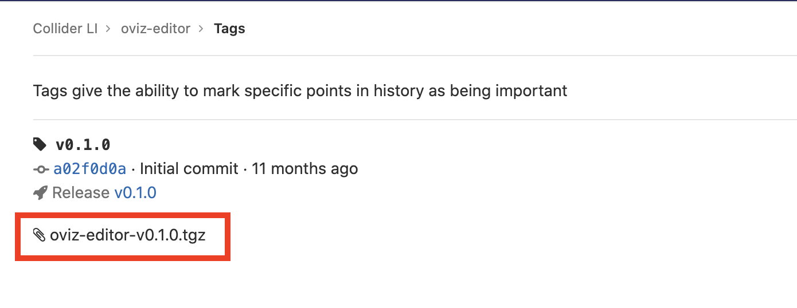
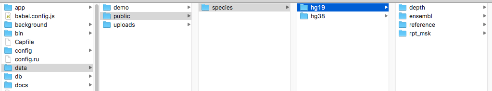

## !!! VERY IMPORTANT MESSAGE  

> The project was built years before and the dependencies are not well maintained to work in various OS systems and OS versions. So here we provide **self-check** for the prerequisites. You should run these commands and make sure that you have correctly installed the dependency and set the environment before you proceed. 

> If you encounter any difficulty during the installation, please first go to [_**git:bvd3-rails:issues**_](https://delta.cs.cityu.edu.hk/lhc/bvd-rails/-/issues?scope=all&utf8=%E2%9C%93&state=all) and check if there is a solution. If not, please open a new issue.

> It is very common to encounter some problems that know group developer has ever met. So please try your best to google it and solve it by yourself first.


## Prerequisites

#### This guideline is for Linux/Windows Subsystem for Linux Users

> For those new to linux and WSL, we strongly recommend **WSL2** and **Ubuntu**. You can also use other linux OS or virtual machine if you know what to do.

> Ubuntu is used in the following guideline, you may want to check the official installation guides if you use another linux os.

#### 1. Ruby

1. install rbenv. See the detailed instructions [here](https://github.com/rbenv/rbenv).
  ```
  $ sudo apt install rbenv
  ```
2. install __Ruby 2.7.1__ (might update to later versions, check current value in `.ruby-version`)
  ```
  rbenv install 2.7.1
  ```
  **self-check**: the ruby and gem paths should be the rbenv one
  ```console
  user@users-iMac meta_platform % which ruby
  /Users/user/.rbenv/shims/ruby
  user@users-iMac meta_platform % gem env home
  /Users/user/.rbenv/versions/2.7.1/lib/ruby/gems/2.7.0
  ```
>! wrong example here, the default ruby is the system ruby
  ```console
  user@dclb4027 ide-frontend % gem env home
  /Library/Ruby/Gems/2.6.0
  ```


### 2. Node and Yarn
> **Node 14** is enough for junior developper, however, if you have multiple projects to work on, you might want to install **NVM** to help manage your Node versions.

1. install __[Node](https://nodejs.org/en/download/package-manager/)__ 14, either directly install or install via __[NVM](https://github.com/nvm-sh/nvm#install--update-script)__
  ``` bash
  # Ubuntu directly install node 14
  curl -fsSL https://deb.nodesource.com/setup_14.x | sudo -E bash -
  sudo apt-get install -y nodejs

  # or using nvm
  # you might need to manually set the environment
  curl -o- https://raw.githubusercontent.com/nvm-sh/nvm/v0.39.0/install.sh | bash
  nvm install 14.17.0
  ```
  
  **self-check**
  
  ``` shell-session
  user@users-iMac meta_platform % node -v
  v14.17.0
  ```
2. install yarn  __[Yarn](https://yarnpkg.com/en/docs/install)__
  ```
  npm install --global yarn
  ```

  
### 3. __[PostgreSQL](https://www.postgresql.org/download/)__ as the database.
1. install postgresql. See the official instructions for Ubuntu [here](https://www.postgresql.org/download/linux/ubuntu/).
  ```bash
  # here we use 12, but you may also try later versions if your os suppport
  sudo sh -c 'echo "deb http://apt.postgresql.org/pub/repos/apt $(lsb_release -cs)-pgdg main" > /etc/apt/sources.list.d/pgdg.list'
  wget --quiet -O - https://www.postgresql.org/media/keys/ACCC4CF8.asc | sudo apt-key add -
  sudo apt-get update
  # Install the latest version of PostgreSQL.
  # If you want a specific version, use 'postgresql-12' or similar instead of 'postgresql':
  sudo apt-get -y install postgresql
  ```

**self-check**:
> You can check later in the step _create database_

> Choose the right version of postgresql for your OS

## Initialization

### 0. Get the project

Create an account at https://delta.cs.cityu.edu.hk and add your [ssh key](https://help.github.com/articles/generating-a-new-ssh-key-and-adding-it-to-the-ssh-agent/) in user settings https://delta.cs.cityu.edu.hk/profile/keys.

`cd` to a folder where you would like to place this project and clone it:

```bash
git clone https://delta.cs.cityu.edu.hk/chelijia/meta_platform.git
```

Now _go to the project root_:

```bash
cd meta_platform
```

### 1. Install dependencies

0. install bundler

    In Ruby, each package is called a _gem_, and is managed through the command `gem`; however we won't use it directly.
    We'll use the _bundler_ gem as our dependency manager:

    ```bash
    gem install bundler
    ```

1. Install all ruby dependencies using _bundler_:

    ```bash
    # in meta_platform
    bundle install
    ```

2. `cd ..` to your _**$workspace**_, clone and install crux.

    ```bash
    # in your workspace
    #clone wyf-dev branch for the latest functions at this moment
    git clone -b wyf-dev https://delta.cs.cityu.edu.hk/lhc/crux.git
    cd crux
    yarn install
    yarn build
    ```

3. Download **oviz-editor** [oviz-editor-v0.1.0.tgz](https://delta.cs.cityu.edu.hk/lhc/oviz-editor/-/tags)
  
    

4. Install all front-end dependencies using _yarn_:

    ```bash
    # in meta_platform
    yarn install
    ```

  **self-check:**

    Now the file structure of your workspace should look like this:
    ```
    --your workspace
      --crux
      --meta_platform
      --oviz-editor-v0.1.0.tgz

    ```

?>From now on, all commands should run under the project root folder, in this case it's meta_platform.


### 2. Create database user

You can find the current database configuration in `config/database.yml`, including username and database name.
Rails will create databases for you, but you must create the database user manually.


Switch to user `postgres` and create a user named _CHE_ by running the following command lines. Its name should be CHE and should be able to _create database_:

```bash
  sudo su - postgres
  createuser --interactive
  exit
```

Then enable the postgreSQL service to make it run automatically on start up.
Depending on your Linux distro, you may need to use `systemctl` or `service`:

```bash
# Ubuntu, run manually
sudo service postgresql start
# Ubuntu, auto start on boot
sudo update-rc.d postgresql defaults
```

By default, no password is configured for development database. Therefore, you must edit the `pg_hba.conf`
(locates at `/etc/postgresql/12/main` on Ubuntu) on your system and set `METHOD` to `trust` for localhost. Notice that the directory differs if you use another version of postgresql.


### 3. Setup database

Simply run the following commands to setup the development database.

  ```bash
  bin/rails db:create
  bin/rails db:migrate
  ```

#### 4. ~~Add public file data~~

Some analyses will use the public data (file apis). You can ask in the wechat group for the data. (_**not required at this time**_)

  


## Start local server

Run the following command to launch your local server.

```bash
rails s
# open a new terminal tab and ran the second command
bin/webpack-dev-server
```

Now, go to [localhost:3000](localhost:3000) and you should see the website.
