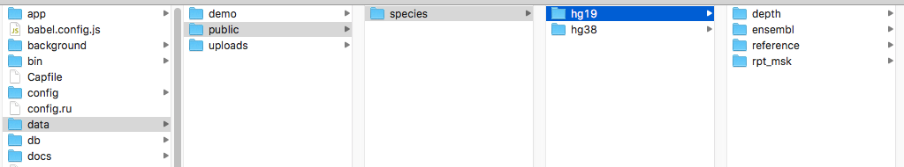

## Prerequisites

- macOS or Linux (Windows is not recommended. You can use WSL only if you know what you're doing).

- __Ruby 2.7.1__ (might update to later versions, check current value in `.ruby-version`), installed by [rbenv](https://github.com/rbenv/rbenv) with [ruby-build](https://github.com/rbenv/ruby-build) plugin.
  - macOS: `brew install rbenv`
  - Linux: Use [rbenv-installer](https://github.com/rbenv/rbenv-installer)
- __[Node](https://nodejs.org/en/download/package-manager/)__ and __[Yarn](https://yarnpkg.com/en/docs/install)__ to manage front-end dependencies.
- __[PostgreSQL](https://www.postgresql.org/download/)__ as the database.
  - macOS: `brew install postgresql`
  - Linux: See the above page

## Initialization

#### 0. Get the project

Create an account at https://delta.cs.cityu.edu.hk and add your [ssh key](https://help.github.com/articles/generating-a-new-ssh-key-and-adding-it-to-the-ssh-agent/) in user settings https://delta.cs.cityu.edu.hk/profile/keys.

`cd` to a folder where you would like to place this project and clone it:

```bash
git clone https://delta.cs.cityu.edu.hk/chelijia/meta_platform.git
```

Now _go to the project root_:

```bash
cd meta_platform
```

#### 1. Install dependencies

In Ruby, each package is called a _gem_, and is managed through the command `gem`; however we won't use it directly.
We'll use the _bundler_ gem as our dependency manager:

```bash
gem install bundler
```

Install all ruby dependencies using _bundler_:

```bash
bundle install
```

Install all front-end dependencies using _yarn_:

```bash
yarn install
```

Clone and install crux.

```bash
git clone https://delta.cs.cityu.edu.hk/lhc/crux.git
cd crux
yarn install
yarn build
```

Download oviz-editor [oviz-editor-v0.1.0.tgz](https://delta.cs.cityu.edu.hk/lhc/oviz-editor/-/tags).

Now the file structure of your workspace should look like this:
```
--your workspace
  --crux
  --meta_platform
  --oviz-editor-v0.1.0.tgz

```

?>From now on, all commands should run under the project root folder, thus meta_platform.


#### 2. Create database user

You can find the current database configuration in `config/database.yml`, including username and database name.
Rails will create databases for you, but you must create the database user manually.

__macOS__

Create a user named _CHE_ by running the following command line. It should have be able to _create database_:

```bash
createuser --interactive
```

Then read the output of  `brew info postgresql` on _how to start the database_.

__Linux__

Switch to user `postgres` and create the same user. Its name should be _virus_ and should be able to _create database_:

```bash
sudo su - postgres
createuser --interactive
exit
```

Then enable the postgreSQL service to make it run automatically on start up.
Depending on your Linux distro, you may need to use `systemctl` or `service`:

```bash
# Arch
sudo systemctl enable postgresql
# Ubuntu, run manually
sudo service postgresql start
# Ubuntu, auto start on boot
sudo updtae-rc.d postgresql defaults
```

By default, no password is configured for development database. Therefore, you must edit the `pg_hba.conf`
(locates at `/etc/postgresql/10/main` on Ubuntu) on your system and set `METHOD` to `trust` for localhost
(by default it may be `md5`).


#### 3. Setup database

Simply run the following commands to setup the development database.

```bash
bin/rails db:create
bin/rails db:migrate
# Pass --extras to add support for BTDraw.
# You can do this later by running the same command with --extras_only=yes.
bin/rails db:seed extras=analyses,api,pipelines
```

#### 4. Add public file data

Some analyses will use the public data (file apis). You can ask in the wechat group for the data. (_not required at this time_)


## Start local server

Run the following command to launch your local server.

```bash
rails s
# open a new terminal tab and ran the second command
bin/webpack-dev-server
```

Now, go to [localhost:3000](localhost:3000) and you should see the website.

## Developer's tools

[Visual studio code](https://code.visualstudio.com/) has lots of extensions for different coding language and is strongly recommended as the code editor. 

Used extensions:
- tslint for typescript, install it in the vscode extension market
- bvt for Oviz template, [installation instruction](https://docs.oviz.org/#/get-started?id=vscode-plugin) 


